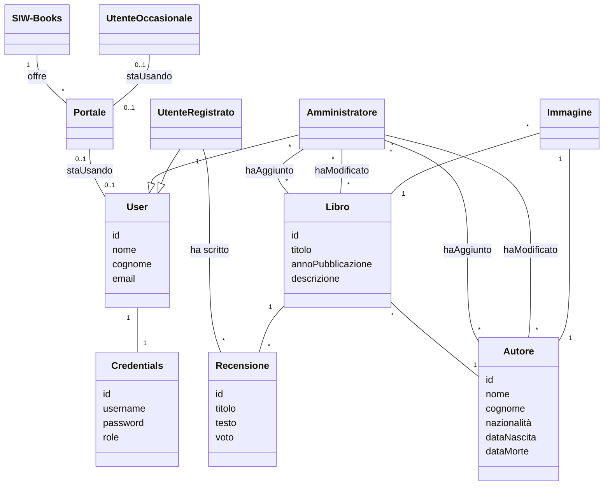

# 📚 SIW-Books

**SIW-Books** è un'applicazione web realizzata come progetto accademico per il corso di **Sistemi informativi su Web (SIW)** presso l'Università degli Studi di Roma Tre.

L'applicazione permette agli utenti di:

- 🧐 Consultare un catalogo di libri e autori
- 📝 Lasciare una singola recensione per ciascun libro
- 🔐 Accedere tramite autenticazione utente
- 👤 Visualizzare i dettagli di ciascun autore o libro

---

## 🚀 Tecnologie utilizzate

- **Java 17**
- **Spring Boot**
- **Spring MVC + Thymeleaf**
- **Spring Data JPA + Hibernate**
- **Spring Security**
- **PostgreSQL**
- **HTML + CSS (Thymeleaf templating)**

---

## ⚙️ Funzionalità principali

### Utente anonimo:
- ✅ Visualizza l'elenco di tutti i libri disponibili
- ✅ Consulta le informazioni dettagliate di ciascun libro e autore

### Utente autenticato:
- 📝 Aggiunge una recensione a un libro (massimo **una** per libro)
- 👁️ Visualizza le proprie recensioni
- 📚 Naviga tra autori e i relativi libri scritti

---

## 🔐 Autenticazione

L'autenticazione è gestita con **Spring Security**. Ogni utente può registrarsi, accedere e lasciare una recensione. Le credenziali sono collegate a un'entità `User`.

---

## 🧩 Modello di Dominio

## 📄 Casi d'uso
**Caso d'uso UC1: Ricerca di un autore - attore primario: un'utente occasionale**
1. Un utente occasionale decide di visualizzare la lista degli autori per cercare un autore
2. L'utente inserisce nome o cognome dell'autore che gli interessa. Il sistema mostra gli autori che corrispondono a quel nome o cognome
3. L'utente seleziona l'autore interessato. Il sistema mostra i dettagli relativi a quell'autore

**Caso d'uso UC2: Ricerca di un libro - attore primario: un'utente occasionale**
1. Un utente occasionale decide di visualizzare la lista dei libri per cercare un libro
2. L'utente inserisce titolo del libro che gli interessa. Il sistema mostra i libri che corrispondono a quel titolo
3. L'utente seleziona il libro interessato. Il sistema mostra i dettagli relativi a quel libro

**Caso d'uso UC3: Ricerca di un autore - attore primario: un'utente registrato**
1. Un utente registrato decide di visualizzare la lista degli autori per cercare un autore
2. L'utente inserisce nome o cognome dell'autore che gli interessa. Il sistema mostra gli autori che corrispondono a quel nome o cognome
3. L'utente seleziona l'autore interessato. Il sistema mostra i dettagli relativi a quell'autore

**Caso d'uso UC4: Ricerca di un libro - attore primario: un'utente registrato**
1. Un utente registrato decide di visualizzare la lista dei libri per cercare un libro
2. L'utente inserisce titolo del libro che gli interessa. Il sistema mostra i libri che corrispondono a quel titolo
3. L'utente seleziona il libro interessato. Il sistema mostra i dettagli relativi a quel libro

**Caso d'uso UC5: Inserimento recensione - attore primario: un'utente registrato**
1. Un utente registrato decide di inserire una recensione a un libro
2. L'utente seleziona il libro interessato. Il sistema mostra i dettagli del libro e il bottone "Aggiungi nuova Recensione"
3. L'utente clicca sul bottone "Aggiungi nuova Recensione". Il sistema mostra la pagina per aggiungere una nuova recensione
4. L'utente inserisce titolo, testo e un voto alla recensione e clicca sul bottone di conferma. Il sistema reindirizza l'utente alla pagina del libro aggiornata (il sistema non permette l'inserimento della recensione se l'utente ha già scritto una recensione per quel libro)

**Caso d'uso UC6: Ricerca di un autore - attore primario: l'amministratore**
1. L'amministratore decide di visualizzare la lista degli autori per cercare un autore
2. L'amministratore inserisce nome o cognome dell'autore che gli interessa. Il sistema mostra gli autori che corrispondono a quel nome o cognome
3. L'amministratore seleziona l'autore interessato. Il sistema mostra i dettagli relativi a quell'autore

**Caso d'uso UC7: Ricerca di un libro - attore primario: l'amministratore**
1. L'amministratoredecide di visualizzare la lista dei libri per cercare un libro
2. L'amministratore inserisce titolo del libro che gli interessa. Il sistema mostra i libri che corrispondono a quel titolo
3. L'amministratore seleziona il libro interessato. Il sistema mostra i dettagli relativi a quel libro

**Caso d'uso UC8: Inserimento nuovo libro - attore primario: l'amministratore**
1. L'amministratore decide di inserire un nuovo libro nel sistema 
2. L'amministratore va nella pagina della lista libri. Il sistema mostra l'elenco dei libri e il bottone "Aggiungi nuovo libro"
3. L'amministratore clicca sul pulsante. Il sistema mostra la pagina di inserimento di un libro
4. L'amministratore inserisce titolo, anno di pubblicazione, una o più copertine del libro e gli autori del libro selezionandoli da una tendina che mostra gli autori presenti nel sistema. 
5. L'amministratore conferma l'inserimento. Il sistema reindirizza l'amministratore alla pagina della lista libri

**Caso d'uso UC9: Inserimento nuovo autore - attore primario: l'amministratore**
1. L'amministratore decide di inserire un nuovo autore nel sistema 
2. L'amministratore va nella pagina della lista autori. Il sistema mostra l'elenco degli autori e il bottone "Aggiungi nuovo autore"
3. L'amministratore clicca sul pulsante. Il sistema mostra la pagina di inserimento di un autore
4. L'amministratore inserisce nome, cognome, nazionalità, anno di nascita, anno della morte, una foto dell'autore e i libri scritti dall'autore selezionandoli da una tendina che mostra i libri presenti nel sistema. 
5. L'amministratore conferma l'inserimento. Il sistema reindirizza l'amministratore alla pagina della lista autori

**Caso d'uso UC10: Visualizza dati account - attore primario: un utente registrato**
1. Un utente registrato decide di vedere i dati del proprio account
2. L'utente seleziona "Account" dalla navbar. Il sistema mostra username e il ruolo DEFAULT e i bottoni per modificare e cancellare l'account

**Caso d'uso UC11: Modifica dati account - attore primario: un utente registrato**
1. Un utente registrato decide di modificare i dati del proprio account
2. L'utente seleziona "Account" dalla navbar. Il sistema mostra username e il ruolo DEFAULT e i bottoni per modificare e cancellare l'account
3. L'utente seleziona la modifica dell'account. Il sistema mostra la pagina di modifica account
4. L'utente può scegliere di modificare il proprio nome, cognome, email, data di nascita, username e password. 
5. L'utente conferma la modifica. Il sistema reindirizza l'utente alla sua pagina account

**Caso d'uso UC12: Visualizza dati account - attore primario: l'amministratore**
1. L'amministratore decide di vedere i dati del proprio account
2. L'amministratore seleziona "Account" dalla navbar. Il sistema mostra username e il ruolo ADMIN, i bottoni per modificare e cancellare l'account e la lista degli utenti registrati al sistema

**Caso d'uso UC13: Modifica dati account - attore primario: l'amministratore**
1. L'amministratore decide di modificare i dati del proprio account
2. L'amministratore seleziona "Account" dalla navbar. Il sistema mostra username e il ruolo ADMIN, i bottoni per modificare e cancellare l'account e la lista degli utenti registrati al sistema
3. L'amministratore seleziona la modifica dell'account. Il sistema mostra la pagina di modifica account
4. L'amministratore può scegliere di modificare il proprio nome, cognome, email, data di nascita, username e password. 
5. L'amministratore conferma la modifica. Il sistema reindirizza l'utente alla sua pagina account

**Caso d'uso UC14: Eliminazione utente registrato - attore primario: l'amministratore**
1. L'amministratore decide di modificare i dati del proprio account
2. L'amministratore seleziona "Account" dalla navbar. Il sistema mostra username e il ruolo ADMIN, i bottoni per modificare e cancellare l'account e la lista degli utenti registrati al sistema
3. L'amministratore clicca sul bottone elimina dell'utente registrato interessato. Il sistema reindirizza l'amministratore alla pagina del proprio account aggiornata

