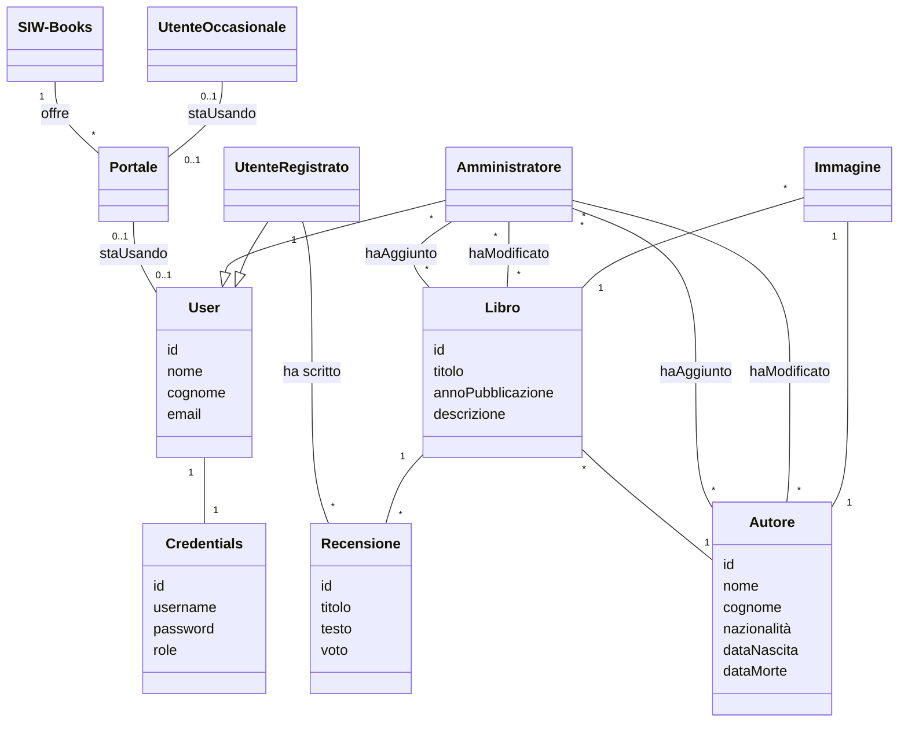

# 📚 SIW-Books

**SIW-Books** è un'applicazione web realizzata come progetto accademico per il corso di **Sviluppo di Applicazioni Web (SIW)** presso l'Università degli Studi di Roma Tre.

L'applicazione permette agli utenti di:

- 🧐 Consultare un catalogo di libri e autori
- 📝 Lasciare una singola recensione per ciascun libro
- 🔐 Accedere tramite autenticazione utente
- 👤 Visualizzare i dettagli di ciascun autore o libro

---

## 🚀 Tecnologie utilizzate

- **Java 17**
- **Spring Boot**
- **Spring MVC + Thymeleaf**
- **Spring Data JPA + Hibernate**
- **Spring Security**
- **PostgreSQL**
- **HTML + CSS (Thymeleaf templating)**

---

## ⚙️ Funzionalità principali

### Utente anonimo:
- ✅ Visualizza l'elenco di tutti i libri disponibili
- ✅ Consulta le informazioni dettagliate di ciascun libro e autore

### Utente autenticato:
- 📝 Aggiunge una recensione a un libro (massimo **una** per libro)
- 👁️ Visualizza le proprie recensioni
- 📚 Naviga tra autori e i relativi libri scritti

---

## 🔐 Autenticazione

L'autenticazione è gestita con **Spring Security**. Ogni utente può registrarsi, accedere e lasciare una recensione. Le credenziali sono collegate a un'entità `User`.

---

## 🧩 Modello di Dominio
